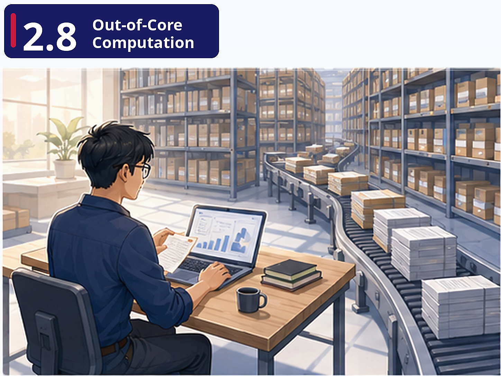

# Pre-class brief

### Where are we?

FreshCart's data science team asks you to process the full 3-year order history — 50 million rows. You try loading it into pandas and your laptop kernel crashes. The data simply doesn't fit in RAM. You need tools that can process datasets larger than your machine's memory without requiring a distributed cluster.

### Why this matters

This is the bridge between single-machine processing (Module 1's pandas) and distributed processing (Unit 2.9's Spark). Not every problem needs a Spark cluster — many "big" datasets (1–50 GB) can be handled on a single machine with the right tools. Polars and DuckDB are increasingly the tools of choice for this "medium data" sweet spot, and they're dramatically faster than pandas even for datasets that *do* fit in memory. Understanding lazy evaluation here also prepares you conceptually for Spark.

### Key concepts

**Lazy Evaluation** — Instead of loading the entire dataset into memory and then processing it, lazy evaluation builds a *query plan* first and executes it only when you call `.collect()`. With `streaming=True`, Polars processes the data in chunks that fit in memory. This is the same concept Spark uses at distributed scale.

**Polars vs Pandas** — Polars leverages Apache Arrow's columnar memory format and multi-threaded execution. The hands-on timing comparisons make the performance difference concrete. For FreshCart, switching a daily report from pandas to Polars might reduce runtime from 20 minutes to 2 minutes — with zero infrastructure changes.

**DuckDB as an Embedded Analytical Database** — DuckDB lets you write SQL queries directly against CSV and Parquet files without loading them into a separate database. It's "SQLite for analytics." An analyst can query a 10 GB Parquet file on their laptop using familiar SQL, without needing access to BigQuery.

